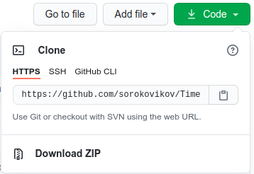

TimeSeries2ComplexNetworks
==========================
TimeSeries2ComplexNetworks - это программа, предназначеная для конвертирования 
*временных рядов* в *комплексные сети* и их визуализации.

Требования к системе
-----------------------
* Python 3.6+

Установка
---------
Чтобы воспользоваться программой следуйте следующим инструкциям.
1. Скачайте или клонируйте проект:
    1. Нажмите кнопку **⤓ Code**.
    2. Скачайте архив, нажав на кнопку **Download ZIP**, и распакуйте его или
    скопируйте адрес репозитория и выполните в командной строке команду 
    `git clone https://github.com/sorokovikov/TimeSeries2ComplexNetworks.git`.
    
       

2. Перейдите в каталог программы.
3. В командной строке выполните команду `python setup.py install`.
4. Перейдите в каталог **/app**, находясь в командной строке.
5. Запустите программу, выполнив в командной строке команду `python __main__.py`.

Использование
-------------
Для использования программы вводите номера действий, числа (границы интервалов) и 
следуйте указаниям.

Вы можете загрузить собственную выборку с помощью CSV-файла, 
указав его относительный или абсолютный путь.